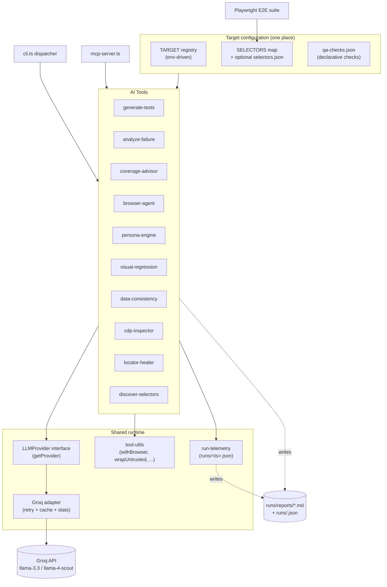

# AI-Native QA Toolkit

An autonomous, AI-powered QA ecosystem built on top of Playwright. Goes beyond
static test scripts — uses LLM inference to generate tests, diagnose failures,
audit coverage, browse autonomously, stress-test with synthetic personas, and
analyze visual UX across viewports.

The toolkit is target-agnostic. It ships pre-configured against
[cal.com](https://cal.com) as a real-world example (see
[tests/examples/cal-com/](tests/examples/cal-com)) but every cal.com-specific
fact lives in a single example pack — re-target via env vars and a
`selectors.json` overlay (see [Targeting your own app](#targeting-your-own-app)).

For the full per-tool reference see [docs/tools.md](docs/tools.md). For
engineering rationale see [docs/architecture.md](docs/architecture.md). For
the change history see [CHANGELOG.md](CHANGELOG.md).

---

## Architecture



---

## Project Structure

```text
qa-playwright/
  ai-tools/             # 15 modules — 9 user-facing AI tools + shared runtime
  scripts/
    check-readme.ts     # Verifies every README command/file reference resolves
    check-secrets.ts    # Pre-commit + CI credential scanner
  tests-unit/           # Vitest unit tests (130 tests / 17 files)
  tests/
    toolkit/            # Toolkit's own CLI smoke spec (offline, no API keys)
    examples/
      generic/          # Drop-in specs for any site (homepage smoke, a11y basics)
      cal-com/          # Bundled live-target example — scheduling app (re-target via env vars)
      wikipedia/        # Second example — non-scheduling target with no testid scaffold
    ai-generated.spec.ts  # Quarantined output of generate-tests
  docs/
    tools.md            # Detailed reference for the 9 AI tools + MCP integrations
    architecture.md     # Engineering philosophy and key engineering decisions
  .github/workflows/    # Playwright e2e, CodeQL, AI quarantine — all SHA-pinned
  cli.ts                # Unified CLI — npx tsx cli.ts <command>
  mcp-server.ts         # MCP server exposing all tools to LLM clients
```

---

## Quickstart

### Prerequisites

- Node.js v20+
- A Groq API key — free at [console.groq.com](https://console.groq.com)

### Install

```bash
npm install
npx playwright install
```

### Configure

```bash
cp .env.example .env
```

```env
GROQ_API_KEY=your_key_here       # Required
BASE_URL=https://cal.com         # Optional — default: https://cal.com
HOST_NAME=Bailey Pumfleet        # Optional — expected host in assertions
BOOKING_PATH=/bailey/chat        # Optional — default: /bailey/chat
QA_TARGET_NAME=cal.com           # Optional — short label in CLI / logs
QA_TARGET_DESCRIPTION=...        # Optional — sentence injected into LLM prompts
```

### Run

```bash
# E2E — all browsers
npx playwright test

# Single browser
npm run test:chromium
npm run test:firefox
npm run test:webkit

# AI-generated tests only (Chromium)
npm run test:ai-generated

# Unit tests
npm run test:unit
npm run test:unit:watch
npm run test:unit:coverage

# Doc drift + secret scan
npm run check:docs
npm run check:secrets
```

---

## AI Tools

| # | Tool | One-liner |
| --- | --- | --- |
| 1 | [generate-tests](docs/tools.md#1-test-generator) | Write a complete Playwright test for any URL |
| 2 | [analyze-failure](docs/tools.md#2-failure-analyzer) | Diagnose a Playwright error log → root cause + fix |
| 3 | [coverage-advisor](docs/tools.md#3-coverage-advisor) | Score a spec out of 10 and write the top 3 missing tests |
| 4 | [browser-agent](docs/tools.md#4-autonomous-browser-agent) | Autonomous agent that completes a goal in a real browser |
| 5 | [persona-engine](docs/tools.md#5-synthetic-persona-engine) | Synthetic personas to stress-test edge cases |
| 6 | [visual-regression](docs/tools.md#6-visual-regression-ai-vision) | AI vision UX analysis across desktop/tablet/mobile |
| 7 | [data-consistency](docs/tools.md#7-data-consistency-checker) | Cross-page data integrity checker (declarative) |
| 8 | [cdp-inspector](docs/tools.md#8-cdp-inspector) | CDP-level network + console + tRPC inspection |
| 9 | [locator-healer](docs/tools.md#9-ai-locator-healer) | Heal a broken selector with 5 verified ranked replacements |

All tools share the same CLI conventions (`--help`, `--json`, `--quiet`) and
exit-code semantics — see [docs/tools.md](docs/tools.md#cli-conventions-all-9-tools).

---

## CLI

All tools are accessible through a single unified command:

```bash
npx tsx cli.ts <command> [options]
```

| Command | What it does |
| --- | --- |
| `generate <url>` | Generate Playwright tests from a URL |
| `analyze` | Analyze a test failure and get a fix |
| `coverage` | Score test coverage and get missing tests |
| `visual <url>` | AI vision analysis across viewports |
| `agent <goal> <url>` | Autonomous browser agent |
| `personas` | Synthetic persona engine |
| `consistency` | Data consistency checker |
| `cdp <url>` | CDP browser protocol inspector |
| `heal [selector] [url]` | Heal a broken locator with AI suggestions |
| `discover <url>` | Auto-discover `data-testid` selectors via LLM (writes `selectors.json`) |
| `mcp <url>` | Playwright MCP server demo |
| `test` | Run the full Playwright test suite |
| `report` | Open the Playwright trace viewer |

```bash
# Examples
npx tsx cli.ts generate https://cal.com/bailey/chat
npx tsx cli.ts visual https://cal.com/bailey/chat
npx tsx cli.ts agent "verify booking flow" https://cal.com/bailey/chat
npx tsx cli.ts heal "getByTestId('old-id')" https://cal.com/bailey/chat
npx tsx cli.ts test
```

---

## Targeting your own app

The toolkit ships pre-configured for [cal.com](https://cal.com) as the
primary real-world example. A second smaller pack against
[Wikipedia](https://en.wikipedia.org) is included to validate that the
abstraction is target-shape-agnostic — Wikipedia has no `data-testid`
attributes and no booking flow, and the spec passes regardless. The two
packs live side-by-side under [tests/examples/](tests/examples).

To point the toolkit at your own app:

1. **URL & paths** — set `BASE_URL` and `BOOKING_PATH` env vars (no code change
   needed). The `TARGET` object derives the booking and profile URLs from these
   automatically.
2. **`data-testid` strings** — drop a `selectors.json` at the workspace root to
   override individual roles without touching code:

   ```bash
   # Auto-discover testids on your own page via LLM:
   npx tsx cli.ts discover https://your-app.example.com/some-page
   # → writes selectors.json
   ```

   At runtime, every entry in `selectors.json` overlays the matching key in
   the default `SELECTORS` map. Unknown keys are ignored, missing keys keep
   their defaults.
3. **Data-consistency checks** — drop a `qa-checks.json` at the workspace root
   (or pass `--checks path/to/file.json` to `data-consistency.ts`) to
   declaratively define which fields to cross-check across which pages.
   Placeholders `{TARGET.bookingUrl}`, `{TARGET.profileUrl}`, and
   `{TARGET.baseUrl}` are expanded at load time.
4. **Prompt phrasing** — set `QA_TARGET_NAME` and `QA_TARGET_DESCRIPTION` so
   the personas, agents, and analyzers describe your app (not cal.com) when
   talking to the LLM.
5. **Profile-URL shape** — by default the profile is the first path segment
   (`/:user/:event` → `/:user`). If your app uses a different shape, override
   `TARGET.profileFromBookingUrl` in `ai-tools/selectors.ts`.

The example POM in [tests/examples/cal-com/pages/BookingPage.ts](tests/examples/cal-com/pages/BookingPage.ts)
and the e2e suite in [tests/examples/cal-com/booking-flow.spec.ts](tests/examples/cal-com/booking-flow.spec.ts)
are intentionally cal.com-shaped — fork them as scaffolding for your own target.

---

## CI

Three GitHub Actions workflows run on every push and pull request — all
SHA-pinned for supply-chain safety:

- [playwright.yml](.github/workflows/playwright.yml) — gitleaks → typecheck →
  lint → format → secret regex → unit tests + coverage → README drift → e2e
  across Chromium/Firefox/WebKit → upload artifacts.
- [codeql.yml](.github/workflows/codeql.yml) — weekly + per-push security scan.
- [ai-quarantine.yml](.github/workflows/ai-quarantine.yml) — daily AI-generated
  spec regeneration and run, non-blocking.

**Required secrets:** `GROQ_API_KEY` for any e2e step that exercises an AI tool.
Tests that don't hit the LLM run cleanly even when this is empty.

**Repo hygiene:**
- [.github/dependabot.yml](.github/dependabot.yml) — weekly grouped npm +
  GitHub Actions update PRs.
- [scripts/check-secrets.ts](scripts/check-secrets.ts) — fast pre-commit and
  CI scanner for known credential patterns. Run via `npm run check:secrets`.
- Husky pre-push runs the full gate: tsc, eslint, prettier, unit tests,
  coverage thresholds, doc drift, secret scan.

---

## License

ISC — see [LICENSE](LICENSE).
